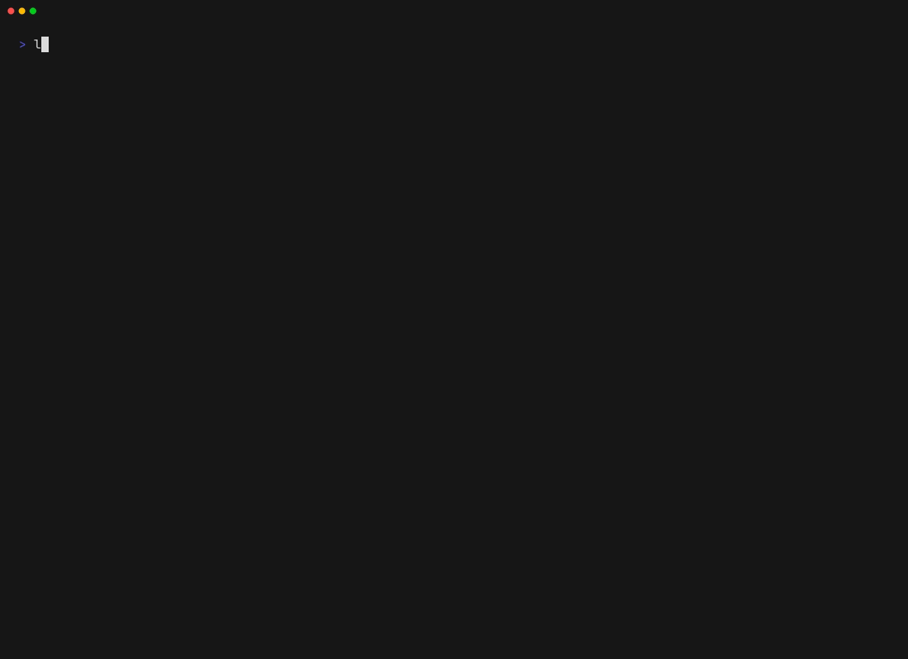

# specsnl/labelsync

Synchronise GitHub issue/PR labels across a set of repositories from a local YAML file.

`labelsync` is a reconciler, not a script: for each target repository it reads the current labels,
resolves the desired set, computes an ordered plan, and then applies it — or prints it, under
`--dry-run`. One `labels.yml` describes the labels you want; groups describe which repositories
should have them. Running it twice changes nothing the second time.



The command surface, then a real dry run against three public repositories — two renames each, one
drifted description, and everything else already in sync. It writes nothing, and the exit code
carries the `2` bit because it found drift.

```yaml
# labels.yml
version: 1

groups:
  ours:
    org: yourorg
    exclude: ["*-archive"]

defaults:
  groups: [ours]

renames:
  - from: "bug"
    to: "type: bug"

labels:
  - name: "type: bug"
    color: "d73a4a"
    description: "Something isn't working"
  - name: "type: feature"
    color: "0e8a16"
    description: "New functionality"
```

```sh
labelsync groups            # which repositories that selects, and why the rest were filtered out
labelsync sync --dry-run    # the plan; writes nothing; exits 2 if anything has drifted
labelsync sync              # apply it
```

What it does, in one list:

- **Creates, updates, and converges** names, colours, descriptions, and casing across every
  selected repository. Nothing is deleted unless you ask for `--mode=prune`, which reports first
  and then asks which labels to remove.
- **Renames without losing anything.** A `renames:` entry becomes a `PATCH`, so every issue and
  pull request that carried the old label still carries it under the new name.
- **Never touches a repository no group selects.** That is the safety property the rest is built
  on.
- **Runs in CI.** `--dry-run` sets the `2` bit on drift, so a pull-request check fails when the
  committed config and the live labels disagree — test the bit, because a run that also skipped a
  repository exits `6`. `--output=json` emits NDJSON with a stable `error_kind`.

## Install

```sh
brew install specsnl/tap/labelsync
```

Or `go install github.com/specsnl/labelsync@latest`, or download a `tar.gz` for your platform from
the [releases page](https://github.com/specsnl/labelsync/releases) — Linux and macOS, amd64 and
arm64.

Building from a checkout needs nothing but Docker and [Task](https://taskfile.dev):

```sh
task build
```

## Getting started

**Export before you write a config.** Descriptions in the config file are authoritative, so a
config written from scratch clears every description your repositories already have:

```sh
labelsync export yourorg/yourrepo --out labels.yml
```

The rest — describing the repositories, the dry run, the first apply — is in
[Getting started](https://labelsync.specs.dev/docs/usage/getting-started/), and everything else —
the configuration file, every command and flag, running in CI, and how it is built — is on the same
site: **[labelsync.specs.dev](https://labelsync.specs.dev/)**.

## Contributing

Every command runs through [Task](https://taskfile.dev), which wraps the Docker Compose services
that pin the Go, golangci-lint, Node, and Hugo versions — so a check runs the same way locally as it
does in CI. Run `task --list` for the full set.

```sh
task checkall   # tidy:check, lint, test, md:check — run this before opening a pull request
```

Conventions, workflow, and the house rules that reviews are held to: [AGENTS.md](./AGENTS.md).
