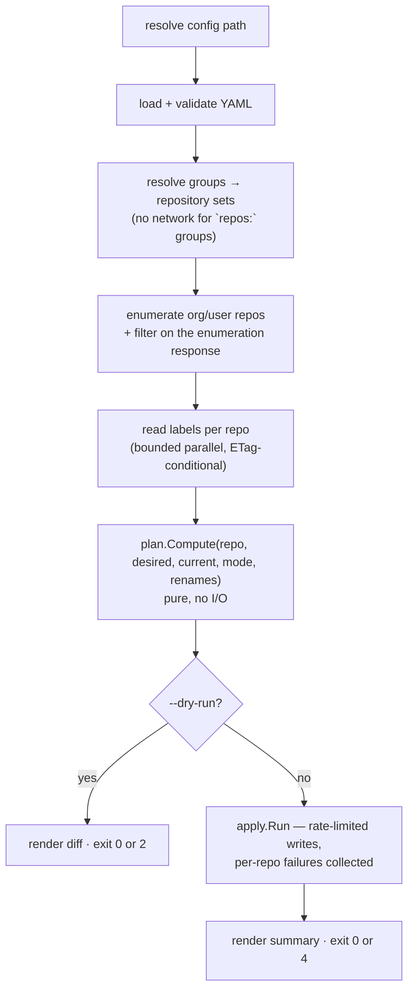

`labelsync` synchronises GitHub issue/PR labels across a configured set of repositories, using a
local YAML file as the source of truth. It is a reconciler, not a script: for each target
repository it reads the current labels, resolves the desired set, computes an ordered plan, and
then applies it — or prints it, under `--dry-run`.

Full rationale, prior art, and the algorithm in detail:
[design.md](https://github.com/specsnl/labelsync/blob/main/docs/design.md).

## Package structure

```text
labelsync/
├── main.go                       # XDG init, cmd.Execute()
├── go.mod
└── internal/
    ├── labelsync/                # values every other package depends on
    │   ├── configuration.go      # XDG paths, config file name constants
    │   └── errors.go             # sentinel errors + KindOf()
    ├── cmd/                      # one file per Cobra command
    ├── config/                   # YAML load, validation, group → repo resolution
    ├── github/                   # auth, client, enumeration, label CRUD, ETag cache
    │   └── ratelimit/            # token bucket, backoff, countdown rendering
    ├── plan/                     # Compute() — pure, no network — Action, rendering, candidates
    ├── palette/                  # Allocate() + deterministic HSL candidate grid
    ├── apply/                    # executes a Plan, in append or prune mode
    └── util/
        ├── exit/                 # exit codes
        ├── output/               # Writer (pretty + NDJSON), table renderers, slog setup
        └── validate/             # shared validators
```

### Implemented so far

| Package                | Status  | Notes                                                                                                |
|------------------------|---------|------------------------------------------------------------------------------------------------------|
| `internal/labelsync`   | landed  | XDG config/cache paths, config file names, sentinels, `KindOf`                                       |
| `internal/util/exit`   | landed  | The four exit codes — see [Output & Exit Codes]()                           |
| `internal/util/output` | landed  | `Writer`, pretty + NDJSON, TTY detection, `slog` wiring                                              |
| `internal/cmd`         | landed  | Every command; `sync` applies in both modes, and owns the prune selection                            |
| `internal/config`      | landed  | Load, validate, resolve, the `init` scaffold — see [Configuration]() |
| `internal/palette`     | landed  | The candidate grid and `Allocate` — see [Colour Palette]()                 |
| `internal/plan`        | landed  | `Action`, `Plan`, `Compute` in both modes, rendering — see [Planner]()        |
| `internal/github`      | landed  | Auth, client, enumeration, labels, ETag cache, the limiter and its countdown                         |
| `internal/apply`       | landed  | Creates, updates, recolours, and deletes under prune — see [Apply]()         |
| everything else        | planned | See the milestone table in the design plan                                                           |

### Why `plan` and `palette` are isolated

Neither imports `internal/github`. `plan.Compute` takes plain structs and returns plain structs;
`palette.Allocate` takes colours and returns one. Two consequences:

1. The interesting logic — group resolution, prune semantics, colour allocation, determinism — is
   testable with table-driven stdlib tests and zero HTTP mocking.
2. A future `plan -o file` / `apply file` split becomes a thin serialisation shell rather than a
   restructuring exercise.

## CLI command tree

```text
labelsync [--config <path>]
          [--debug]
          [--output pretty|json]          default: pretty
          [--no-cache]
          [--concurrency N]               default: 8
          [--write-rate N]                writes/min, default: 70
          [--max-wait <duration>]         default: 15m
│
├── sync                                  reconcile labels
│     [--dry-run] [--mode append|prune] [--prune all]
│     [--group <name>]... [--repo <owner/repo>]...
├── export <owner/repo> [--out <file>]    dump a repo's labels as config YAML
├── init [--force]                        scaffold a labels.yml
├── groups [--group <name>]...            resolve and list group → repo membership
├── cache {clear|info}                    inspect and empty the ETag store
└── version [--dont-prettify]
```

Everything above exists. `sync` applies in both modes: append by default, and `--mode=prune`
additionally reports every unconfigured label as a removal candidate and asks which of them to
delete — `huh.MultiSelect` on a terminal, `--prune=all` without one, and a refusal
(`interactive_required`) rather than a prompt shown to a pipe. See
[Usage § Prune]() and [Apply]().

### How the tree is wired

`internal/cmd` is the shell around everything else, and it is deliberately thin:

- **`root.go`** builds the root command, defines every persistent flag, and resolves them once in
  `PersistentPreRunE`. `Execute` / `ExecuteContext` are what `main` calls; `NewRootCmd` is exported
  so a test builds the same tree and points `SetOut` / `SetErr` at buffers.
- **`app.go`** holds the `App`: the output writer, the handle on the debug log level, and the
  resolved persistent-flag values. Every command closes over one, so a test constructs a single
  `App` and drives the whole tree through it.
- **`init.go`** writes the starter config. The file it writes belongs to `internal/config` —
  `config.Scaffold()` — so it is validated by that package's own suite rather than being a string
  literal here that nothing checks; see
  [Configuration § The scaffold](). The command's own share is where
  the file goes and when it refuses to write.
- **`client.go`** is the shared plumbing every network command runs on: resolve a token, build the
  client from the persistent flags, load and resolve the config, print whatever the resolution
  wanted said out loud. It is one function per step so that `--token`, `--no-cache`, `--write-rate`
  and `--max-wait` cannot mean one thing in one command and another in the next. `App.GitHub` is
  the seam an end-to-end test drives it through — extra client options, applied last, pointing at
  `net/http/httptest` and a temporary cache directory.
- **`groups.go`** resolves group membership and prints it. The product is the table on stdout; the
  explanation — what each filter removed, which groups came back empty — is on stderr, because
  `labelsync groups --output=json | jq` has to keep working.
- **`sync.go`** is the pipeline end to end: config, client, groups, enumeration, label reads,
  `plan.Compute` per repository, render, and then — unless `--dry-run` said otherwise — the writes,
  through [`internal/apply`](). It is the only command that assembles a `Plan`, the only
  one that writes anything, and the only one whose answer is an exit code as much as a rendering —
  see [Exit codes](#exit-codes) below. The plan goes to stdout *before* anything is written, so a
  user watching a long apply can see what it is about to do, and so the stdout of an apply matches
  the stdout of the dry run that preceded it. Under `--mode=prune` that ordering is load-bearing
  rather than a courtesy: the plan is the removal report the selection is made against.
- **`prune.go`** is the part of prune that needs a person, and the only part of the whole feature that
  involves a terminal. It validates nothing and writes nothing: it turns the candidates a plan carries
  into the ones that will be deleted, either from `--prune=all` or from a `huh.MultiSelect`, and hands
  back a plan narrowed with `plan.RetainDeletes`. The prompt draws on **stderr**, like everything else
  that narrates a run, so `--output=json | jq` never receives a redrawn form mid-stream. The guard
  that keeps it away from a pipe lives in `sync.go`'s flag validation, because its whole value is
  firing before the first request; `App.Prompt` is the seam a test replaces both the prompt and the
  terminal through.
- **`export.go`** dumps one repository's labels as config YAML. It is the only command that writes
  to `App.Stdout` rather than through `App.Out`, because its product is a *file* and not a record;
  see [Output § An export is a file](). The rendering
  itself belongs to `internal/config`, next to the loader whose normalisation it has to match.
- **`cache.go`** inspects and empties the ETag store. It is the command that most needs the
  record/table split — an `int64` of bytes and an RFC 3339 timestamp in the record, `1.2 MiB` and
  `3 days ago` in the columns — and the only one that deletes anything, which is why the directory
  it is pointed at is bounded explicitly; see
  [GitHub Client § Inspecting and clearing]().
- **`version.go`** owns `Version`, the variable `.goreleaser.yml` and the `Dockerfile` inject with
  `-ldflags -X github.com/specsnl/labelsync/internal/cmd.Version`. That path is a build-file string
  the compiler never checks, so `version_test.go` asserts both files still name it — a rename would
  otherwise ship every release as `dev`. What each build produces is in
  [Versioning]().

`labelsync --version` is defined to mean `labelsync version --dont-prettify`, and both call the same
`writeVersion` so the two cannot drift. It is a hand-rolled flag rather than Cobra's built-in
`cmd.Version` + `SetVersionTemplate`, because Cobra handles that flag inside `execute()` *before*
`PersistentPreRunE`. At that point `--output` has not been read and
`app.Out` is still the fallback writer, so `--output=json --version` would print a bare line into a
stream that is supposed to be typed JSON objects. Routing it through the root's `RunE` gets it the
writer the user asked for. Giving the root a `RunE` is also why there is a test that a bare
`labelsync` still prints help and an unknown subcommand still fails.

Two invariants carry the weight, both detailed in
[Output & Exit Codes](): writers and the logger come from
`cmd.OutOrStdout()` / `cmd.ErrOrStderr()` rather than the `NewDefault*` constructors, and `os.Exit`
lives in `main` and nowhere else. Commands return errors; `exit.Of` turns them into codes.

### Exit codes

| Code | Constant       | Meaning                                                            |
|------|----------------|--------------------------------------------------------------------|
| `0`  | `exit.OK`      | In sync — no changes needed, or applied successfully with no drift |
| `1`  | `exit.Error`   | Error (config invalid, auth failure, unrecoverable API error)      |
| `2`  | `exit.Drift`   | Drift detected — `--dry-run` found pending actions                 |
| `4`  | `exit.Skipped` | Applied successfully, but one or more repositories were skipped    |

The outcome codes are disjoint bits and combine — a dry run that both drifts and cannot reach a
repository exits `6`. Defined in `internal/util/exit`; the rationale is in
[Output & Exit Codes]().

`sync` is where they are assembled, and it assembles them by OR-ing outcomes as they are discovered
rather than by assigning over a previous value:

```go
code := exit.OK
if dryRun && drifted(p) {
    code |= exit.Drift
}
code |= failures.ExitCode()
```

Drift is "the plan holds something that would change a repository" — creates, updates, or deletes,
never a no-op, which is a label that was checked and already matched. A non-zero code that is not a
failure returns `&exit.Err{Code: code}` with no wrapped error, so `main` prints nothing.

## Configuration

The config file is resolved in this order:

1. `--config <path>`
2. `./labels.yml` or `./labels.yaml` in the working directory
3. `$XDG_CONFIG_HOME/labelsync/labels.yml` (default `~/.config/labelsync/labels.yml`)

A `--config` value naming a directory is searched the same way. Both spellings in one directory is
`ErrAmbiguousConfigFile`. The ETag cache lives under `$XDG_CACHE_HOME/labelsync`. Both paths come
from `internal/labelsync/configuration.go`.

How that resolution, the YAML load, and the normalisation rules work is in
[Configuration](). For the `groups`, `defaults`, `renames`, and `labels` sections
themselves, see the
[configuration reference]().

## Data flow — `labelsync sync`



**Landed** in append mode, both branches. Step `I` is `apply.Apply`; the diagram calls it `apply.Run`
and the name it was built under is `Apply`. Two things the diagram does not show: the repositories no
configured label selects are dropped *before* the label reads, so no request is spent on a repository
nothing would be done to; and `GET /rate_limit` is read at startup under `--debug` **or** whenever the
run is about to write, because it is free, it seeds the limiter, and its answer is what an apply that
cannot finish is refused on — see [Apply § The startup budget check]().

Steps up to `Compute` never write. Per-repository failures — `403` archived, `404` renamed
mid-run, `410` — are collected and reported at the end rather than aborting the run.

A repository with issues disabled is **not** one of those failures: repository-scoped label
endpoints are ungated on `has_issues`, verified over the full CRUD matrix, so such repositories
sync normally and `410` never appears on them. See
[Labels work when issues are disabled](https://github.com/specsnl/labelsync/blob/main/docs/design.md#labels-work-when-issues-are-disabled).

## Testing

Stdlib `testing` by default — no test framework dependency so far. Run with `task test`.

| Package     | Approach                                                                                                                                                  |
|-------------|-----------------------------------------------------------------------------------------------------------------------------------------------------------|
| `config`    | Table-driven over every validation rule, valid and invalid; group composition and cycles                                                                  |
| `plan`      | The core suite: `(desired, current, mode, renames) → expected actions`, plus [determinism and convergence]() |
| `palette`   | Same input → same output, no duplicate allocation, exhaustion, legibility bounds — see [Colour Palette]()               |
| `github`    | `net/http/httptest` fake: pagination, ETag `304`, per-repo skips, `422` reclassification                                                                  |
| `ratelimit` | Injected clock: primary vs secondary backoff, `Retry-After`, the `--max-wait` ceiling                                                                     |
| `output`    | Golden files for the pretty and JSON renderings                                                                                                           |
| `cmd`       | The tree driven through `SetOut`/`SetErr` buffers: flags, writer choice, exit codes                                                                       |
