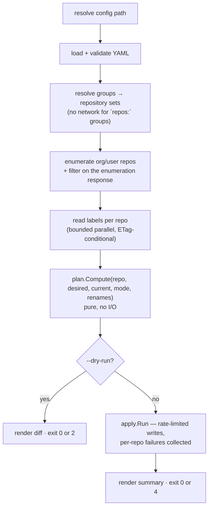

`labelsync` synchronises GitHub issue/PR labels across a configured set of repositories, using a
local YAML file as the source of truth. It is a reconciler, not a script: for each target
repository it reads the current labels, resolves the desired set, computes an ordered plan, and
then applies it — or prints it, under `--dry-run`.

Full rationale, prior art, and the algorithm in detail:
[design.md](https://github.com/specsnl/labelsync/blob/main/docs/design.md).

## Package structure

```text
labelsync/
├── main.go                       # XDG init, cmd.Execute()
├── go.mod
└── internal/
    ├── labelsync/                # values every other package depends on
    │   ├── configuration.go      # XDG paths, config file name constants
    │   └── errors.go             # sentinel errors + KindOf()
    ├── cmd/                      # one file per Cobra command
    ├── config/                   # YAML load, validation, group → repo resolution
    ├── github/                   # auth, client, enumeration, label CRUD, ETag cache
    │   └── ratelimit/            # token bucket, backoff, countdown rendering
    ├── plan/                     # Compute() — pure, no network — Action, rendering
    ├── palette/                  # Allocate() + deterministic HSL candidate grid
    ├── apply/                    # executes a Plan, prune prompts
    └── util/
        ├── exit/                 # exit codes
        ├── output/               # Writer (pretty + NDJSON), table renderers, slog setup
        └── validate/             # shared validators
```

### Implemented so far

| Package                | Status  | Notes                                                                                    |
|------------------------|---------|------------------------------------------------------------------------------------------|
| `internal/labelsync`   | landed  | XDG config/cache paths, config file names, sentinels, `KindOf`                           |
| `internal/util/exit`   | landed  | The four exit codes — see [Output & Exit Codes](./output.md)                             |
| `internal/util/output` | landed  | `Writer`, pretty + NDJSON, TTY detection, `slog` wiring                                  |
| `internal/cmd`         | partial | Root command, `App`, persistent flags, `version`                                         |
| `internal/config`      | partial | Resolution, YAML load, normalisation — see [Configuration](./configuration.md)           |
| `internal/palette`     | landed  | The candidate grid and `Allocate` — see [Colour Palette](./palette.md)                   |
| `internal/plan`        | partial | The `Action` / `Plan` vocabulary and `Compute` in append mode — see [Planner](./plan.md) |
| `internal/github`      | partial | The token resolution chain — see [Authentication](./authentication.md)                   |
| everything else        | planned | See the milestone table in the design plan                                               |

### Why `plan` and `palette` are isolated

Neither imports `internal/github`. `plan.Compute` takes plain structs and returns plain structs;
`palette.Allocate` takes colours and returns one. Two consequences:

1. The interesting logic — group resolution, prune semantics, colour allocation, determinism — is
   testable with table-driven stdlib tests and zero HTTP mocking.
2. A future `plan -o file` / `apply file` split becomes a thin serialisation shell rather than a
   restructuring exercise.

## CLI command tree

```text
labelsync [--config <path>]
          [--debug]
          [--output pretty|json]          default: pretty
          [--no-cache]
          [--concurrency N]               default: 8
          [--write-rate N]                writes/min, default: 70
          [--max-wait <duration>]         default: 15m
│
├── sync                                  reconcile labels
│     [--dry-run] [--mode append|prune] [--prune all]
│     [--group <name>]... [--repo <owner/repo>]...
├── export <owner/repo> [-o <file>]       dump a repo's labels as config YAML
├── init                                  scaffold a labels.yml
├── groups [--group <name>]...            resolve and list group → repo membership
├── cache {clear|info}
└── version [--dont-prettify]
```

Only the root and `version` exist so far; the rest are the leaves still to be added.

### How the tree is wired

`internal/cmd` is the shell around everything else, and it is deliberately thin:

- **`root.go`** builds the root command, defines every persistent flag, and resolves them once in
  `PersistentPreRunE`. `Execute` / `ExecuteContext` are what `main` calls; `NewRootCmd` is exported
  so a test builds the same tree and points `SetOut` / `SetErr` at buffers.
- **`app.go`** holds the `App`: the output writer, the handle on the debug log level, and the
  resolved persistent-flag values. Every command closes over one, so a test constructs a single
  `App` and drives the whole tree through it.
- **`version.go`** owns `Version`, the variable `.goreleaser.yml` and the `Dockerfile` inject with
  `-ldflags -X github.com/specsnl/labelsync/internal/cmd.Version`. That path is a build-file string
  the compiler never checks, so `version_test.go` asserts both files still name it — a rename would
  otherwise ship every release as `dev`. What each build produces is in
  [Versioning](./versioning.md).

`labelsync --version` is defined to mean `labelsync version --dont-prettify`, and both call the same
`writeVersion` so the two cannot drift. It is a hand-rolled flag rather than Cobra's built-in
`cmd.Version` + `SetVersionTemplate`, because Cobra handles that flag inside `execute()` *before*
`PersistentPreRunE`. At that point `--output` has not been read and
`app.Out` is still the fallback writer, so `--output=json --version` would print a bare line into a
stream that is supposed to be typed JSON objects. Routing it through the root's `RunE` gets it the
writer the user asked for. Giving the root a `RunE` is also why there is a test that a bare
`labelsync` still prints help and an unknown subcommand still fails.

Two invariants carry the weight, both detailed in
[Output & Exit Codes](./output.md#wiring-it-in-cobra): writers and the logger come from
`cmd.OutOrStdout()` / `cmd.ErrOrStderr()` rather than the `NewDefault*` constructors, and `os.Exit`
lives in `main` and nowhere else. Commands return errors; `exit.Of` turns them into codes.

### Exit codes

| Code | Constant       | Meaning                                                            |
|------|----------------|--------------------------------------------------------------------|
| `0`  | `exit.OK`      | In sync — no changes needed, or applied successfully with no drift |
| `1`  | `exit.Error`   | Error (config invalid, auth failure, unrecoverable API error)      |
| `2`  | `exit.Drift`   | Drift detected — `--dry-run` found pending actions                 |
| `4`  | `exit.Skipped` | Applied successfully, but one or more repositories were skipped    |

The outcome codes are disjoint bits and combine — a dry run that both drifts and cannot reach a
repository exits `6`. Defined in `internal/util/exit`; the rationale is in
[Output & Exit Codes](./output.md#exit-codes).

## Configuration

The config file is resolved in this order:

1. `--config <path>`
2. `./labels.yml` or `./labels.yaml` in the working directory
3. `$XDG_CONFIG_HOME/labelsync/labels.yml` (default `~/.config/labelsync/labels.yml`)

A `--config` value naming a directory is searched the same way. Both spellings in one directory is
`ErrAmbiguousConfigFile`. The ETag cache lives under `$XDG_CACHE_HOME/labelsync`. Both paths come
from `internal/labelsync/configuration.go`.

How that resolution, the YAML load, and the normalisation rules work is in
[Configuration](./configuration.md). For the `groups`, `defaults`, `renames`, and `labels` sections
themselves, see the
[configuration reference](https://github.com/specsnl/labelsync/blob/main/docs/design.md#configuration).

## Data flow — `labelsync sync`



Steps up to `Compute` never write. Per-repository failures — `403` archived, `404` renamed
mid-run, `410` — are collected and reported at the end rather than aborting the run.

A repository with issues disabled is **not** one of those failures: repository-scoped label
endpoints are ungated on `has_issues`, verified over the full CRUD matrix, so such repositories
sync normally and `410` never appears on them. See
[Labels work when issues are disabled](https://github.com/specsnl/labelsync/blob/main/docs/design.md#labels-work-when-issues-are-disabled).

## Testing

Stdlib `testing` by default — no test framework dependency so far. Run with `task test`.

| Package     | Approach                                                                                                                                    |
|-------------|---------------------------------------------------------------------------------------------------------------------------------------------|
| `config`    | Table-driven over every validation rule, valid and invalid; group composition and cycles                                                    |
| `plan`      | The core suite: `(desired, current, mode, renames) → expected actions`, plus [determinism and convergence](./plan.md#the-determinism-suite) |
| `palette`   | Same input → same output, no duplicate allocation, exhaustion, legibility bounds — see [Colour Palette](./palette.md#testing)               |
| `github`    | `net/http/httptest` fake: pagination, ETag `304`, per-repo skips, `422` reclassification                                                    |
| `ratelimit` | Injected clock: primary vs secondary backoff, `Retry-After`, the `--max-wait` ceiling                                                       |
| `output`    | Golden files for the pretty and JSON renderings                                                                                             |
| `cmd`       | The tree driven through `SetOut`/`SetErr` buffers: flags, writer choice, exit codes                                                         |
